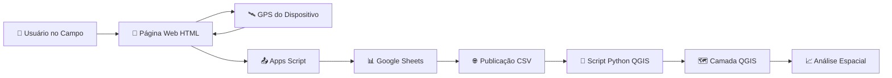
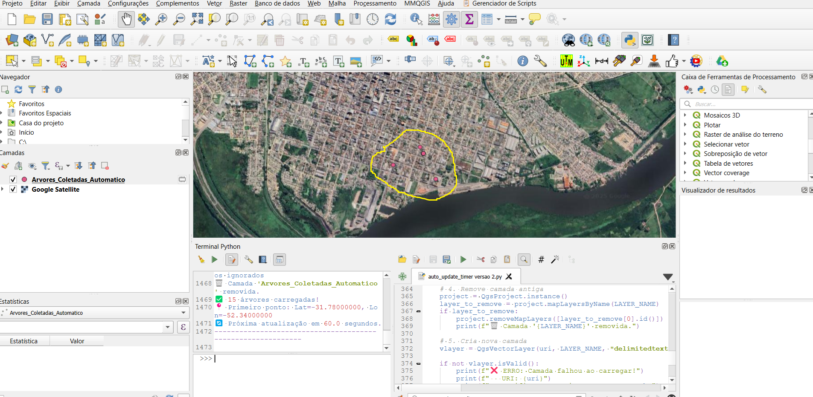

# 🌳 Sistema de Mapeamento de Árvores - LGA

<div align="center">


**Laboratório de Gestão Arbórea - UFPel**

[](https://github.com/seu-usuario/seu-repositorio/releases)
[](LICENSE)
[](https://qgis.org/)
[](https://developer.mozilla.org/en-US/docs/Web/HTML)
[](https://sheets.google.com)

*Sistema integrado para coleta, armazenamento e visualização geoespacial de dados de inventário arbóreo em campo*

[📖 Manual Completo](link-para-manual.pdf) • [🐛 Reportar Bug](mailto:tssiap.sampaio@gmail.com) • [✨ Sugerir Feature](mailto:tssiap.sampaio@gmail.com)

</div>

---

## 📋 Índice

- [Sobre o Projeto](#-sobre-o-projeto)
- [Funcionalidades](#-funcionalidades)
- [Arquitetura do Sistema](#-arquitetura-do-sistema)
- [Demonstração](#-demonstração)
- [Pré-requisitos](#-pré-requisitos)
- [Instalação](#-instalação)
- [Como Usar](#-como-usar)
- [Estrutura do Projeto](#-estrutura-do-projeto)
- [Configuração Avançada](#-configuração-avançada)
- [Solução de Problemas](#-solução-de-problemas)
- [Contribuindo](#-contribuindo)
- [Licença](#-licença)
- [Contato](#-contato)
- [Agradecimentos](#-agradecimentos)

---

## 🌟 Sobre o Projeto

O **Sistema de Mapeamento de Árvores** é uma solução completa desenvolvida pelo Laboratório de Gestão Arbórea (LGA) da UFPel para facilitar o levantamento de campo de árvores urbanas e florestais. 

### 🎯 Problema Resolvido

Tradicionalmente, a coleta de dados de inventário arbóreo envolve:
- ✏️ Anotações manuais em papel (sujeitas a perdas e erros)
- 📍 Coleta separada de coordenadas GPS
- ⌨️ Digitação posterior dos dados
- 🗺️ Importação manual para software GIS

### 💡 Nossa Solução

Sistema integrado de **3 componentes** que automatiza todo o fluxo:

```
📱 Coleta Web (Campo) → ☁️ Google Sheets (Nuvem) → 🗺️ QGIS (Análise)
```

**Benefícios:**
- ⚡ Dados disponíveis em tempo real
- 🎯 Geolocalização automática via GPS
- 📊 Sincronização automática com QGIS
- 🌐 Acesso multiplataforma (celular, tablet, desktop)
- 💾 Backup automático na nuvem
- 🔄 Atualização em tempo real

---

## ✨ Funcionalidades

### 📱 Página Web de Coleta

- 🛰️ **Captura automática de coordenadas GPS** (latitude/longitude de alta precisão)
- 📝 **Formulário responsivo** otimizado para dispositivos móveis
- ✅ **Validação de dados** em tempo real
- 🎨 **Interface intuitiva** com paleta de cores do LGA
- 📤 **Envio instantâneo** para Google Sheets via Apps Script
- ⚠️ **Feedback visual** de sucesso/erro

**Campos coletados:**
- Latitude e Longitude (automático)
- Espécie da árvore
- Altura (metros)
- DAP - Diâmetro à Altura do Peito (cm)
- Condição de saúde (Boa/Média/Ruim)
- Observações (campo livre)
- Timestamp (automático)

### ☁️ Google Sheets (Backend)

- 📊 **Armazenamento estruturado** em planilha na nuvem
- 🔐 **Apps Script** para receber dados via POST
- 🌐 **Publicação automática** em formato CSV
- 📈 **Visualização de dados** em tempo real
- 🔄 **Sincronização** com múltiplos usuários

### 🗺️ QGIS (Visualização)

- 🔄 **Sincronização automática** (intervalo configurável)
- 📍 **Camada de pontos georreferenciados** (EPSG:4326)
- 🛠️ **Correção automática** de formato de coordenadas
- 🔡 **Fix de encoding UTF-8** (caracteres especiais)
- 📊 **Atributos completos** para análise espacial
- 🎨 **Simbolização temática** por saúde, espécie, altura, etc.

---

## 🏗️ Arquitetura do Sistema



### Fluxo de Dados Detalhado

1. **Coleta (Campo)**
   - Usuário abre página web no dispositivo móvel
   - Clica em "Capturar Localização"
   - GPS retorna coordenadas de alta precisão
   - Preenche dados da árvore
   - Clica em "Salvar"

2. **Transmissão**
   - Dados enviados via POST para Apps Script
   - Apps Script valida e insere na planilha
   - Confirmação retorna para usuário

3. **Sincronização**
   - Script Python no QGIS faz requisição HTTP
   - Baixa CSV publicado do Google Sheets
   - Corrige formato de coordenadas
   - Atualiza camada automaticamente

4. **Visualização**
   - Pontos aparecem no mapa do QGIS
   - Usuário pode analisar, simbolizar e exportar

---

## 🖼️ Demonstração

### Interface de Coleta Web

```
┌─────────────────────────────────┐
│   🌳 Mapeamento de Árvores      │
├─────────────────────────────────┤
│ 📍 Localização GPS:             │
│   Latitude:  -31.78119530       │
│   Longitude: -52.34562180       │
│   [Capturar Localização] ✓      │
├─────────────────────────────────┤
│ Espécie: Eucalyptus grandis     │
│ Altura (m): 15.5                │
│ DAP (cm): 32.8                  │
│ Saúde: [Boa ▼]                  │
│ Observações: Árvore saudável... │
│                                 │
│        [Salvar Dados]           │
└─────────────────────────────────┘
```

### Visualização no QGIS


*Camada de pontos sincronizada automaticamente*

---

## 📋 Pré-requisitos

### Software

| Componente | Versão Mínima | Link |
|------------|---------------|------|
| QGIS | 3.40 LTR | [Download](https://qgis.org/download/) |
| Navegador Web | Moderno (Chrome/Firefox/Safari) | - |
| Python | 3.9+ (incluído no QGIS) | - |

### Bibliotecas Python (já incluídas no QGIS)

```python
requests
PyQt5
qgis.core
csv
tempfile
```

### Serviços Online

- ✅ Conta Google (para Google Sheets)
- ✅ Conexão com internet
- ✅ GPS habilitado no dispositivo móvel

---

## 🚀 Instalação

### 1️⃣ Configurar Google Sheets

1. **Acesse a planilha modelo:**
   ```
   https://docs.google.com/spreadsheets/d/1_rY4btBEUfyHOycZL0iT41EAFA-dZ1hvJ42loxVcS2s/edit
   ```

2. **Faça uma cópia para sua conta:**
   - `Arquivo` → `Fazer uma cópia`

3. **Configure o Apps Script:**
   - `Extensões` → `Apps Script`
   - Cole o código fornecido (ver seção [Apps Script](#apps-script))
   - `Implantar` → `Nova implantação`
   - Tipo: `Aplicativo da Web`
   - Executar como: `Eu`
   - Quem tem acesso: `Qualquer pessoa`
   - Copie a URL de implantação

4. **Publique como CSV:**
   - `Arquivo` → `Compartilhar` → `Publicar na Web`
   - Formato: `CSV`
   - Copie o link CSV gerado

### 2️⃣ Configurar Página Web

1. **Clone este repositório:**
   ```bash
   git clone https://github.com/seu-usuario/mapeamento-arvores-lga.git
   cd mapeamento-arvores-lga
   ```

2. **Edite o arquivo `index.html`:**
   - Localize a linha:
     ```javascript
     const SCRIPT_URL = 'SUA_URL_DO_APPS_SCRIPT_AQUI';
     ```
   - Substitua pela URL de implantação do Apps Script

3. **Adicione o logo:**
   - Coloque o arquivo `logo-lga2.png` na mesma pasta

4. **Hospede a página:**
   - **GitHub Pages:**
     - Faça commit e push
     - `Settings` → `Pages` → `Source: main branch`
   - **Ou** abra localmente: `file:///caminho/para/index.html`

### 3️⃣ Configurar QGIS

1. **Abra o QGIS 3.40 LTR**

2. **Abra o Console Python:**
   - `Plugins` → `Console Python`
   - Clique no ícone de editor (segunda aba)

3. **Cole o script Python:**
   - Copie todo o conteúdo de `qgis_sync_script.py`
   - Cole no editor

4. **Configure a URL do CSV:**
   - Localize a linha:
     ```python
     CSV_URL = "SUA_URL_CSV_AQUI"
     ```
   - Substitua pela URL CSV publicada do Google Sheets

5. **Execute o script:**
   - No console Python (primeira aba), digite:
     ```python
     start_auto_update()
     ```

✅ **Pronto!** O sistema está funcionando.

---

## 📘 Como Usar

### 🌲 Coleta de Dados no Campo

1. **Acesse a página web** no celular/tablet
2. **Clique em "Capturar Localização"**
   - Permita acesso ao GPS
   - Aguarde 5-10 segundos
   - Verifique se latitude/longitude foram preenchidas
3. **Preencha os dados da árvore:**
   - Espécie (nome científico ou popular)
   - Altura em metros (use trena ou clinômetro)
   - DAP em centímetros (medido a 1,30m do solo)
   - Condição de saúde (observação visual)
   - Observações (opcional)
4. **Clique em "Salvar Dados"**
5. **Aguarde confirmação:** ✅ "Dados salvos com sucesso!"

**💡 Dica:** Sempre verifique se as coordenadas foram capturadas antes de preencher os outros campos.

### 🗺️ Visualização no QGIS

1. **Inicie a sincronização automática:**
   ```python
   start_auto_update()
   ```
   - Sistema verifica novos dados a cada 60 segundos (padrão)

2. **Observe a camada criada:**
   - Nome: `Arvores_Coletadas_Automatico`
   - Geometria: Pontos (EPSG:4326)

3. **Personalize a visualização:**
   - Clique direito na camada → `Propriedades`
   - Aba `Simbologia` → Configure por:
     - **Saúde:** Verde (Boa), Amarelo (Média), Vermelho (Ruim)
     - **Espécie:** Cor diferente para cada espécie
     - **Altura/DAP:** Tamanho dos símbolos

4. **Consulte atributos:**
   - Ferramenta `Identificar Feições` (ℹ️)
   - Clique em um ponto para ver todos os dados

### ⚙️ Comandos Úteis

```python
# Iniciar sincronização automática (a cada 60s)
start_auto_update()

# Parar sincronização
stop_auto_update()

# Atualizar manualmente (uma vez)
update_layer_from_csv_url()
```

---

## 📁 Estrutura do Projeto

```
mapeamento-arvores-lga/
│
├── 📄 README.md                    # Este arquivo
├── 📄 LICENSE                      # Licença MIT
├── 📄 .gitignore                   # Arquivos ignorados
│
├── 🌐 web/
│   ├── index.html                  # Página de coleta de dados
│   ├── logo-lga2.png               # Logo do laboratório
│   └── README.md                   # Documentação da página web
│
├── 📊 google-sheets/
│   ├── apps-script.js              # Código do Apps Script
│   └── README.md                   # Instruções de configuração
│
├── 🗺️ qgis/
│   ├── qgis_sync_script.py         # Script Python para QGIS
│   ├── qgis_sync_script_v2.py      # Versão alternativa (com fix de encoding)
│   └── README.md                   # Instruções de uso no QGIS
│
├── 📖 docs/
│   ├── manual-usuario.pdf          # Manual completo do usuário
│   ├── images/                     # Screenshots e diagramas
│   └── FAQ.md                      # Perguntas frequentes
│
└── 🧪 examples/
    ├── exemplo-dados.csv           # Dados de exemplo
    └── exemplo-projeto.qgz         # Projeto QGIS de exemplo
```

---

## ⚙️ Configuração Avançada

### Alterar Intervalo de Sincronização

No arquivo `qgis_sync_script.py`, edite:

```python
UPDATE_INTERVAL_MS = 60000  # 60 segundos (padrão)

# Exemplos:
UPDATE_INTERVAL_MS = 30000  # 30 segundos (mais frequente)
UPDATE_INTERVAL_MS = 300000  # 5 minutos (menos frequente)
```

### Personalizar Nome da Camada

```python
LAYER_NAME = "Arvores_Coletadas_Automatico"  # Padrão

# Alterar para:
LAYER_NAME = "Meu_Inventario_2025"
```

### Usar Outro Sistema de Coordenadas

```python
CRS_WKT = "EPSG:4326"  # WGS84 (padrão)

# Exemplos Brasil:
CRS_WKT = "EPSG:31982"  # SIRGAS 2000 / UTM zone 22S
CRS_WKT = "EPSG:4674"   # SIRGAS 2000 (geográfico)
```

### Apps Script

<details>
<summary>📄 Clique para ver o código completo do Apps Script</summary>

```javascript
function doPost(e) {
  try {
    var sheet = SpreadsheetApp.getActiveSpreadsheet().getActiveSheet();
    
    var dados = {
      timestamp: new Date(),
      latitude: e.parameter.Latitude,
      longitude: e.parameter.Longitude,
      especie: e.parameter.Especie,
      altura: e.parameter.Altura,
      dap: e.parameter.DAP,
      saude: e.parameter.Saude,
      observacoes: e.parameter.Observacoes || ""
    };
    
    sheet.appendRow([
      dados.timestamp,
      dados.latitude,
      dados.longitude,
      dados.especie,
      dados.altura,
      dados.dap,
      dados.saude,
      dados.observacoes
    ]);
    
    return ContentService.createTextOutput("Dados salvos com sucesso!");
    
  } catch (error) {
    return ContentService.createTextOutput("Erro: " + error.toString());
  }
}
```

</details>

---

## 🛠️ Solução de Problemas

### ❌ GPS não captura localização

**Sintomas:** Campos de latitude/longitude permanecem vazios

**Soluções:**
1. ✅ Verifique permissões do navegador para acessar localização
2. ✅ Esteja em ambiente aberto (GPS funciona mal em ambientes fechados)
3. ✅ Aguarde 10-30 segundos para sinal forte
4. ✅ Reinicie o navegador
5. ✅ Use Chrome ou Firefox (melhor suporte)

### ❌ Dados não aparecem no QGIS

**Sintomas:** Camada criada mas sem pontos

**Soluções:**

1. **Verifique o console Python:**
   ```python
   update_layer_from_csv_url()
   ```
   - Procure por mensagens de erro

2. **Verifique a URL do CSV:**
   - Acesse manualmente no navegador
   - Deve mostrar dados em formato CSV

3. **Coordenadas inválidas:**
   - Script corrige automaticamente formatos como `-3.178.119.530`
   - Mas se ainda assim falhar, verifique os dados no Google Sheets

4. **Conexão internet:**
   - Script precisa baixar o CSV
   - Verifique firewall/proxy

### ❌ Caracteres estranhos (é, ã, etc.)

**Sintomas:** "Média" aparece como "Média"

**Solução:** Use a versão 2 do script (`qgis_sync_script_v2.py`) que inclui:

```python
def fix_encoding(text):
    """Corrige problemas de encoding UTF-8"""
    # Implementação incluída no script
```

### ❌ Erro: "Layer failed to load"

**Causas comuns:**
- URL do CSV incorreta
- Arquivo CSV vazio
- Formato de coordenadas inválido

**Diagnóstico:**
```python
# No console Python, verifique:
import requests
response = requests.get(CSV_URL)
print(response.text[:500])  # Primeiras linhas
```

---

## 🤝 Contribuindo

Contribuições são bem-vindas! Este projeto é desenvolvido pelo LGA/UFPel mas está aberto à comunidade.

### Como Contribuir

1. **Fork** o projeto
2. **Crie uma branch** para sua feature:
   ```bash
   git checkout -b feature/MinhaNovaFuncionalidade
   ```
3. **Commit** suas mudanças:
   ```bash
   git commit -m 'Adiciona nova funcionalidade X'
   ```
4. **Push** para a branch:
   ```bash
   git push origin feature/MinhaNovaFuncionalidade
   ```
5. **Abra um Pull Request**

### Sugestões de Melhorias

- [ ] Suporte a fotos das árvores
- [ ] Modo offline com sincronização posterior
- [ ] Exportação direta para shapefile
- [ ] App móvel nativo
- [ ] Dashboard de estatísticas
- [ ] Identificação automática de espécies (IA)
- [ ] Medição de altura por foto (photogrammetry)

---

## 📜 Licença

Este projeto está sob a licença **MIT**. Veja o arquivo [LICENSE](LICENSE) para mais detalhes.

```
MIT License

Copyright (c) 2025 Laboratório de Gestão Arbórea - UFPel

Permission is hereby granted, free of charge, to any person obtaining a copy
of this software and associated documentation files (the "Software"), to deal
in the Software without restriction, including without limitation the rights
to use, copy, modify, merge, publish, distribute, sublicense, and/or sell
copies of the Software, and to permit persons to whom the Software is
furnished to do so, subject to the following conditions:

The above copyright notice and this permission notice shall be included in all
copies or substantial portions of the Software.

THE SOFTWARE IS PROVIDED "AS IS", WITHOUT WARRANTY OF ANY KIND, EXPRESS OR
IMPLIED, INCLUDING BUT NOT LIMITED TO THE WARRANTIES OF MERCHANTABILITY,
FITNESS FOR A PARTICULAR PURPOSE AND NONINFRINGEMENT. IN NO EVENT SHALL THE
AUTHORS OR COPYRIGHT HOLDERS BE LIABLE FOR ANY CLAIM, DAMAGES OR OTHER
LIABILITY, WHETHER IN AN ACTION OF CONTRACT, TORT OR OTHERWISE, ARISING FROM,
OUT OF OR IN CONNECTION WITH THE SOFTWARE OR THE USE OR OTHER DEALINGS IN THE
SOFTWARE.
```

---

## 📞 Contato

**Laboratório de Gestão Arbórea (LGA)**  
Universidade Federal de Pelotas (UFPel)

- 📧 **Email:** tssiap.sampaio@gmail.com
- 🌐 **Website:** [em breve]
- 📍 **Endereço:** UFPel - Pelotas/RS - Brasil

---

## 🙏 Agradecimentos

- **Equipe LGA/UFPel e LGEA/UFPel (Laboratório de Geoprocessamento aplicado à análise ambiental** - Desenvolvimento e testes
- **Comunidade QGIS** - Ferramentas open source
- **Google** - Infraestrutura do Google Sheets
- **Colaboradores** - Sugestões e feedback

---

## 📊 Status do Projeto


**Última atualização:** 2025

---

<div align="center">

**Desenvolvido com 🌳 pelo Laboratório de Gestão Arbórea - UFPel**

⭐ Se este projeto foi útil, deixe uma estrela!

</div>
